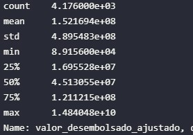
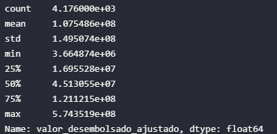
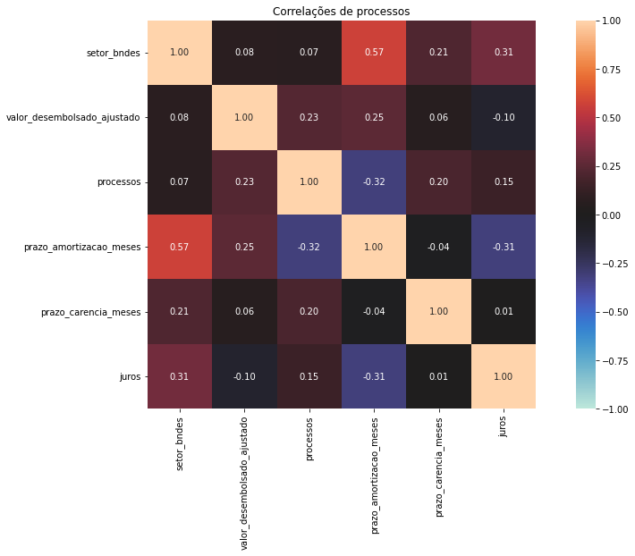
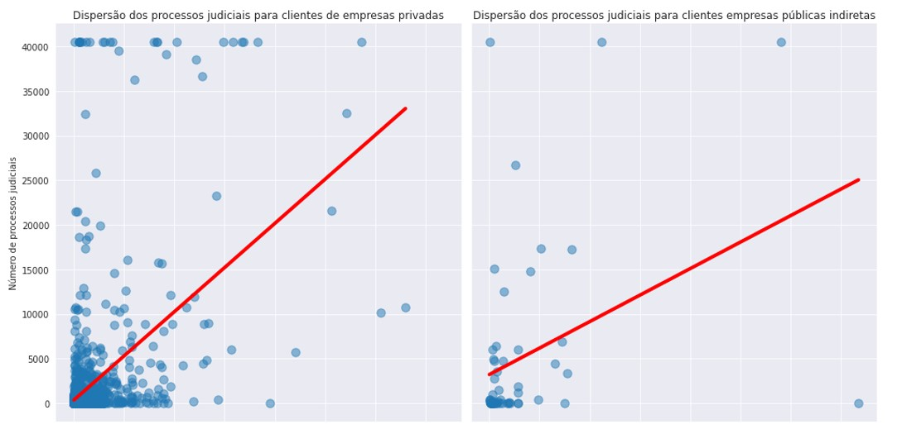
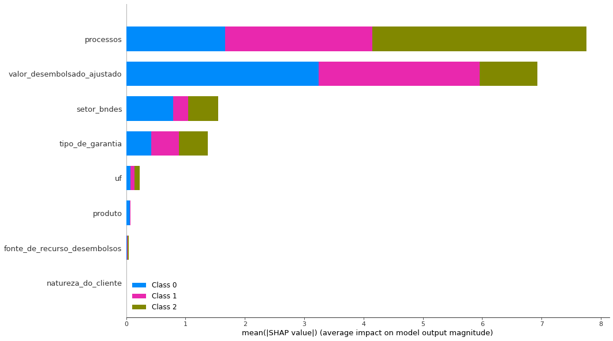

# Análise Exploratória e Machine Learning nos Dados abertos do BNDES

*Em caso de uso, favor citar: Chavez, R. M. Análise Exploratória e Machine Learning nos Dados abertos do BNDES. Prêmio Dados Abertos para o Desenvolvimento. (2021)*

*https://www.linkedin.com/in/renato-chavez/*

*https://github.com/Renatochaz*

**Repositório com todos os códigos, bases de dados e imagens utilizadas para este relatório: https://github.com/Renatochaz/bndes-dados-abertos/**

**Índice**

[TOC]

# 1. Problemas de negócio

# 2. Bases de dados

Esta seção descreve quais bases de dados e ajustes foram realizados para a execução das análises deste projeto.

## 2.1. Dados de financiamento não automáticos do BNDES

A base de dados principal do trabalho é referente ao dataset de financiamentos não automáticos do BNDES. 

O dicionário das variáveis presentes no dataset podem ser consultado em: https://dadosabertos.bndes.gov.br/dataset/operacoes-financiamento/resource/d7c266e2-879f-4f90-a7e7-598d9b6f7738.

As operações de ajuste no dataset foram as seguintes:

- Ingestão via API e seleção das observações dos seguintes setores_bndes: Indústria, Agropecuária e Infraestrutura
- Remoção de 541observações duplicadas
- Remoção de 250 observações da modalidade_de_apoio: Não reembolsável
- Remoção de 189 observações da situação_do_contrato: '-'
- Definição da variável de valor usada em todo o trabalho: valor_desembolsado
- Ajuste de inflação do valor_desembolsado pelo IGP-M, com referência de valor a data de dezembro de 2010, resultando em uma nova variável de valor comparável para todas as observações: valor_desembolsado_ajustado
- Remoção de 834 observações que tinham valor_desembolsado = 0
- Estamos interessados em entender a relação do valor do financiamento por contrato, por isto os dados  são agrupados por contrato (a não ser quando especifica-se no contexto da análise que o agrupamento está em outro nível, como a nível de estado e ano para as análises de IDH)

## 2.2. Dados de emissão de CO2 do Sistema de Estimativas de Emissões e Remoções de Gases de Efeito Estufa

O Sistema de Estimativas de Emissões e Remoções de Gases de Efeito Estufa (SEEG), desenvolvido pelo Observatório do Clima, disponibiliza estimativas anuais das emissões de gases de efeito estufa(GEE) no Brasil. São considerados os gases de efeito estufa(como CO2, CH4, N2O, os HFCs, e apresentados como CO2e) e avaliados todos os cinco setores que são fontes de emissões – Agropecuária, Energia, Mudanças de Uso da Terra, Processos Industriais e Resíduos, em cidades e estados do Brasil.

As estimativas são feitas de acordo com as diretrizes do Painel Intergovernamental sobre Mudanças Climáticas(IPCC), com base na metodologia dos Inventários Brasileiros de Emissões e Remoções Antrópicas de Gases do Efeito Estufa, elaborado pelo Ministério da Ciência, Tecnologia e Inovação(MCTI), e em dados obtidos junto a relatórios governamentais, institutos, centros de pesquisa, entidades setoriais e organizações não governamentais

Essas informações podem ser encontradas no site do SEEG (http://seeg.eco.br/), onde também é possível visualizar e fazer download das estimativas, assim como ver detalhes sobre a metodologia e a qualidade dos dados. Link para artigo com a metodologia do SEEG, publicado na NATURE, em 2018: https://www.nature.com/articles/sdata201845.

Foi usado o gás co2e(t) GWP-AR5 como medida de emissão, pois o CO2e (CO2 equivalente) converte todas as outras medidas e gases em CO2. O GWP é a métrica de conversão mais comum, com base na energia e potencial de aquecimento. O AR5 é o mais recente.

O agrupamento para o setor Agrícola e Industrial foi definido a partir da segmentação indicada pelo SEEG (imagem a baixo).

Dessa forma, a classificação final de grande setor foi a seguinte:

\- Agropecuária = Agropecuária (nível 1) e Mudança de Uso da Terra e Florestas (nível 1)

\- Indústria = Processos Industriais (nivel 1)

Nota-se que uma pequena fração da emissão agropecuária vem de resíduos, e cerca de 20% da emissão industrial vem de energia. 

Para agregar estes dados, é necessário iterar por inúmeras tabelas do SEEG que iriam consumir grande parte do tempo disponível para o concurso, por isso é importante ressaltar que as emissões não estão 100% ajustadas. Essa sugestão fica para futuros trabalhos, que podem inclusive segmentar a emissão por nível 3 e conseguir maior granularidade na análise.

Adicionalmente, é analisado exclusivamente a emissão de CO2, e não a remoção.

## 2.3. Dados do Produto Interno Bruto

Foram levantados dados do produto interno bruto do setor Industrial e Agrícola, para os anos de 2002 a 2017 de todos os estados brasileiros.

Os dados estão em escala de R$1000,00, com a PIB real em valores de 2010 pelo deflator implícito do PIB nacional.

Esta escala foi revertida para o valor em unidade, para ser comparável com o valor_desembolsado_ajustado, que foi deflacionado para a mesma data de valor do PIB.

Os dados do pib estão disponíveis em: http://www.ipeadata.gov.br/Default.aspx

## 2.4. Dados de número de empregados do Cadastro Geral de Empregados e Desempregados

Foram recolhidos dados do número de empregos da plataforma do Cadastro Geral de Empregados e Desempregados (CAGED) do governo. Os dados estão segmentados por ano, setor, estado e tamanho da empresa.

A classificação do tamanho da empresa foi realizada através do padrão adotado no CAGED, que segue o seguinte formato:

Micro: com até 19 empregados.

Pequena: de 20 a 99 empregados.

Média: 100 a 499 empregados.

Grande: mais de 500 empregados.

Os dados estão disponíveis para consulta no seguinte endereço: bi.mte.gov.br/bgcaged

## 2.5. Dados do Índice de Desenvolvimento Humano

Neste trabalho foram usados os dados do Índice de Desenvolvimento Humano (IDH) do Atlas Brasil.

Os dados de IDH estão disponíveis para os estados brasileiros nos anos de 2010, 2016 e 2017.

Dados disponíveis em: http://www.atlasbrasil.org.br/ranking

## 2.6. Dados de quantidade de processos judiciais

Os dados de quantidade de processos judiciais por empresa foram coletados através de um web scrapping (arquivo scrap_processos_judiciais.js) que faz a consulta - empresa por empresa - em todos os tribunais do país pelo site do https://www.jusbrasil.com.br/consulta-processual/.

A quantidade total de processos judiciais de uma empresa é um reflexo da sua contribuição com a sociedade, desta forma usamos a quantidade total de processos de uma empresa como *proxy* para empresas que podem não estar contribuindo tanto para a sociedade quanto se esperaria.

# 3. Análise exploratória

## 3.1. Estatísticas da variável principal: Valor do financiamento por contrato

A variável principal do estudo é o valor do financiamento ajustado do BNDES. Queremos observar se os financiamentos do BNDES estão impulsionando melhorias na sociedade, por isto é analisado o comportamento desta variável dentro do dataset.

 *"The most difficult thing in life is to know youself*

​																*-Thales of Miletus"*

Eu não diria que entender nossa variável é a coisa mais difícil do mundo, mas definitivamente é cansativo. Porém, é fundamental para levantarmos as hipóteses de estudos e direcionamentos para o BNDES, então vamos lá.

### 3.1.1. Estatística descritiva

Pela estatística descritiva da variável, perceba-se que a variável principal é repleta de outliers.

Plotando a função densidade de probabilidade, nota-se uma distribuição não normal com forte assimetria positiva, e características distintas entre o porte do cliente que fez o empréstimo.

Devido a grande influência de outliers, os dados de financiamento são winsorizados nas duas caudas a 5%, buscando uma forma de amenizar a distribuição e possibilitar a busca de relações com outras variáveis.

Uma análise descritiva dos dados winsorizados demonstra uma grande melhora no comportamento da variável:

Plotando a f.d.p, percebe-se uma suavização da distribuição e nota-se com mais clareza a distinção entre o grupo de empresas grandes do resto. 

### 3.1.2. Relação com variáveis categóricas

Observamos uma distinção do comportamento do financiamento para os diferentes setores do BNDES. O Setor de Infraestrutura tem o maior valor médio por contrato, seguido da Indústria e por último a Agropecuária. 

Mesmo com a winsorização, a presença de outliers é evidente.

**A relação do financiamento com a natureza do cliente também parece ser bem distinta, com o maior valor médio de contrato indo as empresas públicas indiretas e para o governo estadual.**

Observando o box-plot para os estados, notamos que as maiores médias de desembolso vão para: Roraima, Pará, Maranhão, Distrito Federal, Amapá, Tocantins e Interestadual.

**Esta é uma tendência interessante, parece que estados menos desenvolvidos fazem um menor número de financiamentos com menor volume total, porém individualmente fazendo grandes contratos.**

### 3.1.3. Relação com variáveis numéricas

Nesta seção iremos analisar apenas a relação com as variáveis numéricas do próprio dataset, pois as informações de IDH, PIB, Número de empregados e Emissão de CO2 estão agrupados por estado e não podemos observar a relação individual de financiamento por contrato com as mesmas. Nas próximas seções exploraremos este ponto assim como a relação com o número de processos.

*Cabe notar que a sequência de pontos contínuos nas caudas dos gráficos vem do método de winsorização utilizado para lidar com outliers.*

Parece haver uma relação negativa entre o valor do financiamento e os juros, indicando que maiores valores de financiamento estão associados a condições melhores de pagamento.

Parece haver uma relação positiva entre o valor do financiamento e os prazo de carência, indicando que maiores valores de financiamento estão associados a condições melhores de pagamento.

Parece haver uma relação positiva entre o valor do financiamento e o prazo de amortização, indicando que maiores valores de financiamento estão associados a condições melhores de pagamento.

**Nota-se que existe um incentivo de custo de oportunidade para empresas que conseguem financiar maiores valores, indicando um incentivo a grandes empresas financiarem.**

### 3.1.4. Heatmap de correlações

Para criar o heatmap de correlações, foi utilizado o módulo nominal.associations do pacote dython. Este módulo é ajustado para analisar a correlação entre variáveis continuas-continuas, categóricas-continuas e categóricas-categóricas.

A correlação entre variáveis continuas-categóricas é um tema com muita discussão, por isso é importante interpretar essas correlações com cautela, até mesmo por que a interpretação de uma variável continua com uma categórica não é intuitiva, no melhor dos casos podemos entender que os fatores da variável categórica tem variâncias distintas em relação a variável contínua, e por isso existe uma correlação.

Para calcular as correlações, o dataset foi agrupado a nível de setor, ano e estado, pois essa é a granularidade dos dados do pib, emissão_co2 e num_empregados (após desagrupar por porte_do_cliente). O idhm está a nível de estado e ano, por isso o cálculo de correlação para essa variável se torna menos preciso, e portanto menos interpretável.

Pontuado estes pontos, vamos as correlações:

- **Valor_desembolsado_ajustado:**

  - Correlação negativa com juros e positiva com carência e amortização, assim como esperado pela análise bivariada.

  - Variação positiva para estado e setor, o estado parece ser mais importante para explicar o financiamento do que o setor, o que está de acordo com os box-plots analisados.

  - Parece haver um indício negativo fraco de correlação com o pib, número de empregos e idh. É esperado que se o BNDES influência estas grandes variáveis macroeconômicas, a sua influência seja limitada. 

    Não é simples indicar se essa evidência é uma correlação significativa e causal ou é uma correlação espúria, faremos análises gráficas mais detalhadas nas próximas seções para levantar hipóteses sobre essa possível correlação.

  - Existe uma correlação negativa e até maior do que o esperado entre o financiamento e as emissões de co2, este parece ser um ponto interessante para invertigar.

- **Outras variáveis:**

  - Encontramos correlações esperadas entre pib, número de empregos e emissão de co2, estado e setor. O heatmap e as variáveis parecem estar de acordo com o que se espera na realidade.

  - Não observamos correlações esperadas para a variável idh, parece que pelo fato do seu agrupamento ser diferente e termos poucos anos disponíveis (2010, 2016 e 2017), não é trivial correlacionarmos o mesmo.

    **Talvez uma estratégia que possa ser adotada por futuros trabalhos é a de juntar as bases de financiamentos automáticos e não automáticos, filtrar para os anos de 2010, 2016 e 2017 com o pib e procurar entender essa relação melhor em um ambiente amostrar apropriado.**

Também estamos interessados em observar as correlações para a quantidade de processos judiciais por empresa, por isso o dataset foi agrupado a nível de cliente, retornando apenas as variáveis principais observadas no heatmap acima e em nível de granularidade compatível com este agrupamento a nível do cliente, para observar como a correlação de processos judiciais se comporta.

- **Processos judiciais:**

  - **Parece haver uma correlação positiva com o financiamento, indicando que clientes com maior número de processos judiciais pegar financiamentos maiores.** 

    Isso faz sentido, pois clientes maiores fazem empréstimos maiores e em geral tem maior número de processos. Mas esse é um ponto interessante que será explorado mais afundo.

  - Outra correlação que se destaca é a correlação negativa com o prazo de amortização. Pelo que observamos do BNDES, essa correlação deveria ser positiva, pois se clientes maiores tem mais processos, e fazem empréstimos maiores, deveriam ter um prazo de amortização maior pelo que observamos acima. 

    **Esse não parece ser o caso, então será possível que o BNDES capta que estas empresas por terem maior quantidade de processos, tem maior risco e consequentemente menor estímulo ao financiamento? Esse é um ponto importante que será analisado nas próximas seções.**

    

## 3.2 Eixo Sustentabilidade: Financiamentos do BNDES e as emissões de CO2

Observou-se na seção 3.1 que parece haver algum indício de que os financiamentos do BNDES contribuam para uma diminuição das emissões de CO2. 

Neste tópico é feita uma análise gráfica de séries temporais, com o objetivo de observar o comportamento das emissões de CO2 de alguns setores dos estados brasileiro, e se parece haver alguma tendência com os desembolsos do BNDES para este setor-estado.

### 3.2.1. Comportamento da emissão de CO2 para os produtos do BNDES.

Primeiro vamos observar a tendência de emissões em relação ao financiamento do BNDES  de modo geral:

Da mesma forma que foi observado durante a análise de correlação, parece haver uma tendência de que maiores valores de financiamento estão associados a um menor nível de emissão de CO2. 

O BNDES tem o produto BNDES FINEM, que entre outros instrumentos financeiros, englobam os incentivos sustentáveis do banco.

Filtrou-se o dataset para os produtos BNDES FINEM e plotou-se a mesma relação:

Aparentemente, entre o grupo de empresas que optam por produtos BNDES FINEM, desembolsos maiores se relacionam com menores emissões de CO2.

Agora, filtrando o dataset para produtos que **não** sejam do BNDES FINEM, observamos a seguinte tendência:

Agora a tendência se inverte e financiamentos maiores parecem estar associados a maiores níveis de emissão de CO2.

**Parece que o produto BNDES FINEM tem um bom direcionamento para objetivos sustentáveis, essa é uma relação que pode ser estudada com maior detalhamento em trabalhos futuros.**

Devido aos dados de emissão de CO2 estarem disponíveis para a Indústria e Agropecuária, iremos analisar estes dois setores separadamente nas próximas sessões.

### 3.2.2. Maiores emissores de CO2  da indústria brasileira e o financiamento BNDES.

Embora **fazer uma análise para cada estado seja uma boa oportunidade de atuação para trabalhos futuros**, não houve tempo suficiente para realizar essa análise por estado neste estudo. Aqui é feita uma primeira exploração no problema ao olharmos para os três estados que mais emitem CO2:

Observa-se que os maiores emissores são o estado de Minas Gerais, seguido por São Paulo e Rio de Janeiro.

Minas Gerais parece estar aumentando sua emissão ao longo dos anos, enquanto São Paulo vem diminuindo e o Rio se mantém estável, com um pico entre 2010 e 2013.

- **MG**

   O desembolso do BNDES para a Indústria destes estados, nota-se que houve um crescimento dos financiamentos entre 2002 e 2007. Este acumulo de financiamentos pode estar associado a algum projeto de longa duração que surtiu efeito na diminuição das emissões entre 2008 e 2009. Porém os financiamentos foram diminuindo ao longo do restante do período e as emissões aumentando.

  **A indústria do MG parece ser um local que o BNDES poderia direcionar incentivos do produto FINEM, visto que é o maior emissor do país e vem requisitando poucos incentivos ao longo dos últimos anos.**

  

- **SP**

  No estado de São Paulo observou-se um grande volume de financiamento do BNDES, que veio diminuindo ao mesmo tempo que as emissões de CO2 do estado também diminuíram. Parece haver a possibilidade de que os financiamentos do BNDES contribuíram para este efeito, e **este é um ponto que vale a pena um estudo mais profundo de inferência de causalidade.**

Observando os estados com maior PIB da indústria, nota-se que são os mesmos estados que são os maiores emissores de CO2.

Porém, o maior PIB da indústria é do estado de São Paulo, que se mantém muito maior que os outros estados mesmo tendo diminuído consideravelmente sua emissão de CO**2.**

**Aparentemente, a diminuição da emissão não causa um grande impacto no PIB deste setor, e este é um ponto importante para o BNDES levantar ao incentivar as indústrias de outros estados a diminuírem seus níveis de emissão, além de ser importante direcionar os financiamentos.**

### 3.2.3 Maiores emissores de CO2  da agropecuária brasileira e o financiamento BNDES

Utilizando a mesma estratégia da análise pro setor industrial, nesta sub-seção procurou-se analisar como as emissões de CO2 do setor da agropecuária se relacionam com os financiamentos do BNDES.

Observa-se que os maiores emissores são o estado do Mato Grosso, seguido do Pará e de Rondônia.

Os três estados parecem estar diminuindo os níveis de emissão ao longo do tempo, porém cabe destacar que pelo que foi observado pelo gráfico do SEEG e pela escala de emissão deste gráfico, que as emissões da agropecuária são muito maiores que as da indústria.

Diferente do cenário da indústria, observa-se que o financiamento do BNDES para os estados que mais emitem CO2 da agropecuária são bem menos relevantes.

A escala do valor do desembolso deste gráfico é muito menor que a do setor da indústria, Mato Grosso teve um pico de investimento no começo do século XXI e parou de fazer financiamentos desde 2015. 

O estado do Pará teve pouquíssimos financiamentos entre 2007 e 2012 e Rondônia não teve financiamentos.

Levando em conta que estes estados são os maiores responsáveis pela emissão de CO2 **total do Brasil**, levanta-se aqui a sugestão que o BNDES **direcione financiamentos, principalmente do produto FINEM para estados com urgência, pois existe uma grande oportunidade de atuação.**

Observando os estados com maior PIB da agropecuária brasileira, notamos que eles não são os estados responsáveis pelo maior volume de emissões de CO2, conforme o gráfico abaixo:

As emissões de CO2 destes estados está em uma escala dez vezes menor do que a dos estados do MT, PA e RO, indicando que seu nível de emissão é muito menor, porém seus PIBS são os maiores para o país.

Observando o incentivo do BNDES para a agropecuária destes estados, observa-se que o BNDES financia muito mais suas atividades, o que é compreensível visto que são os estados com maior PIB deste setor.

**Porém, como foi pontuado anteriormente, estes estados não apresentam grandes oportunidades no eixo da sustentabilidade. Uma estratégia muito mais importante é atingir os estados que mais emitem CO2 da agropecuária, que não são os mesmos que procuram mais financiamentos hoje em dia.**

## 3.3 Eixo Econômico: Financiamentos do BNDES, PIB e Número de empregos

Observou-se na seção 3.1 que existem indícios fracos de que os financiamentos do BNDES estejam correlacionados a estados com menor riqueza.

Conforme foi pontuado, não é simples indicar se essa evidência é uma correlação significativa, pois a riqueza de um estado depende de uma grande quantidade de características observáveis e não observáveis, e é esperado que se o BNDES influência estas grandes variáveis macroeconômicas, a sua influência seja estritamente limitada. 

Para explorar este ponto, foram feitas visualizações simples de tendências que podem servir como hipóteses para trabalhos futuros, que podem explorar estes pontos em maior profundidade e chegar a conclusões mais assertivas.

### 3.3.1. Tendência do comportamento do Financiamento do BNDES em relação a riqueza dos estados

Nesta seção os dados não estão mais agrupados por setor, e sim a nível de estado e de ano, em formato de painel.

Usou-se este formato para analisar o comportamento dos financiamentos do BNDES para os níveis de riqueza dos estados brasileiros.

Neste gráfico de dispersão observamos uma relação positiva acentuada para os financiamentos do BNDES em relação ao PIB dos estados. 

Este gráfico sugere que estados mais ricos recebam um volume total maior de financiamentos.

A tendência observada para o PIB é a mesma para a quantidade de empregos, o que é esperado, já que maiores PIBS estão altamente correlacionados a maior número de empregos.

### 3.3.2. Financiamento do BNDES em relação as maiores Indústrias do país

Nesta seção foi utilizado a quantidade de empregos como proxy de riqueza para os setores industriais.

Os dados da quantidade de empregos foram agrupados a nível de setor, resultando no gráfico abaixo:

Nota-se que embora SP e MG continuem aparecendo com maiores estados da Indústria, o estado do Rio grande do Sul substituir o estado do Rio de Janeiro nesta seção, pois embora a indústria do RS tenha um PIB menor, este estado tem maior quantidade de empregos.

**Analisando graficamente o desembolso para o estado do RS, parece haver uma similaridade com os desembolsos para o estado do RJ. Isto indica que a tendência de maior volume de financiamentos para estados mais ricos é a mesma, usando tanto o PIB quanto número de empregados como *proxy* para riqueza.**

### 3.3.3. Financiamento do BNDES em relação as maiores Agropecuárias do país

Nesta seção foi utilizado a quantidade de empregos como *proxy* de riqueza para os setores da agropecuária.

Os dados da quantidade de empregos foram agrupados a nível de setor, resultando no gráfico abaixo:

Diferente do gráfico com os maior PIB da agropecuária, o estado de MG aparece aqui como segundo maior em quantidade de empregos para este setor, substituindo o RS que é um dos maiores estados em PIB.

Quando analisamos os incentivos de financiamento para a agropecuária de MG, percebe-se que foram poucos incentivos começando em 2008, com pico em 2013.

**Parece que o setor agropecuário de Minas Gerais apresenta uma boa oportunidade de incentivo, que ainda é pouco explorado.**

### Extra: Gráficos para o IDH.

Conforme pontuado na seção 3.1, os dados do IDH parecem não estarem muito representativos nesta base de dados, pois seria esperado que houvesse uma grande correlação com o PIB e número de empregos, o que não se mostrou nos dados.

Por este motivo, não será feita nenhuma análise para os indicadores de IDH nesta amostra.

Aqui iremos pontuar apenas que esta é uma relação importante a ser explorada mais a fundo, talvez usando esta mesma base dados e filtrando apenas para os anos em que o IDH está disponível para os estados (2010, 2016 e 2017.)

Adicionalmente, alguns gráficos foram plotados para o IDH, eles serão apresentados abaixo, apenas como curiosidade.

***Gráficos de tendência***

***Série temporal dos estados com maior IDH e os desembolsos para os mesmos***

***Série temporal dos estados com menor IDH e os desembolsos para os mesmos***

# 4. Machine Learning: Aprendizado não supervisionado e a relação de processos judiciais.

Processos e tal

## 4.1 Relação dos Financiamentos do BNDES com a quantidade de processos judiciais das empresas

tal e tal

tal e tal e tal

tal e tal

tal e tal

## 4.2 Clusterização por K-Prototypes

tal e tal

tal e tal

tal e tal

### 4.2.1 Diferenças entre grupos clusterizados

tal e tal

# 5. Conclusões

tal e tal
