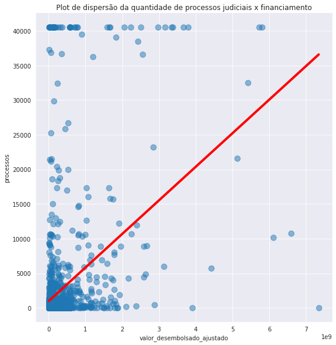
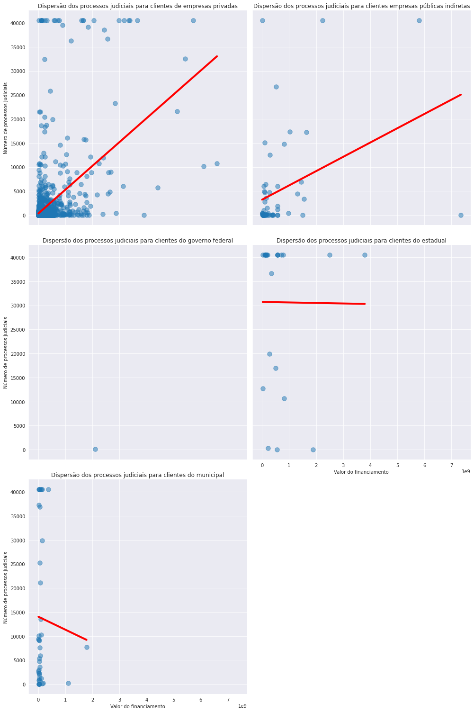
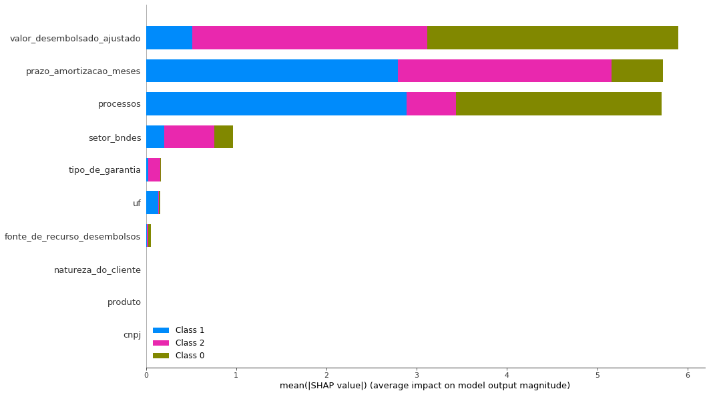
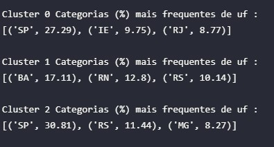
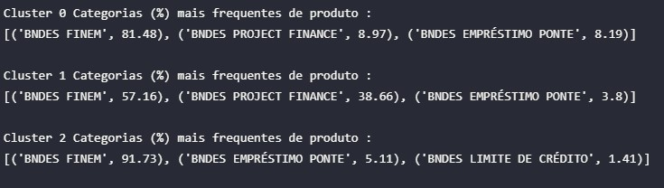
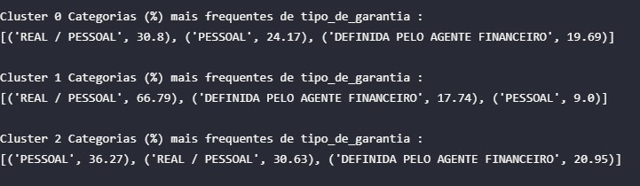

# Machine Learning: Aprendizado não supervisionado e a relação de processos judiciais.

Nesta seção procurou-se explorar a correlação observada entre os processos judiciais das empresas com o  financiamento do BNDES. Conforme comentado no relatório de análises,  é esperado que empresas maiores façam empréstimos maiores, e  que essas empresas tenham mais processos que empresas menores. Buscou-se evidenciar se isso realmente ocorre, ou se existem padrões diferentes relacionados a empresas com mais processos judiciais.

## Relação dos Financiamentos do BNDES com a quantidade de processos judiciais das empresas

O primeiro ponto a ser explorado foi uma análise bivariada do valor do financiamento com a quantidade de processos judiciais, através de um gráfico de dispersão.

Observa-se uma relação positiva entre os processos de uma empresa e o financiamento, indicando que em média, quanto mais processos a empresa tem, maior o valor do financiamento.

A primeira hipótese deste comportamento foi a de que essa tendência pode estar sendo puxada pelo governo, que é um cliente grande e provavelmente tem muitos processos. Para checar se este é o caso, foi plotado o gráfico de dispersão para cada natureza de cliente disponível nos dados.

Prontamente verifica-se que são os clientes de empresas privadas e de administração pública que puxam esta tendência, já o governo parece não ter nenhum tipo de relação com o número de processos.

Também plotou-se a relação do número de processos com o prazo de amortização, para verificar a correlação negativa observada no heatmap.

Parece haver um relação negativa entre o prazo de amortização e os processos judicias da empresa. 

Na seção abaixo tentaremos entender como essas informações se conectam, através de algoritmos de Machine Learning.

## Clusterização por K-Prototypes

Com o objetivo de evidenciar padrões não observadas na análise exploratória, foi proposto um método de aprendizado não supervisionado para clusterizar as empresas que fazem financiamentos com o BNDES.

O método mais comum de clusterização é o K-means, porém o mesmo só é eficiente para amostrar com dados estritamente numéricos, pois a função de custo é calculada através da distância entre pontos, com a distância euclidiana sendo a mais comum. 

Outra opção muito aceita é o Kmodes, porém o mesmo só é eficiente com dados categóricos. No caso dos dados deste estudo, temos uma combinação de dados numéricos com dados categóricos.

Para lidar com problemas deste tipo, um método proposto e bastante aceita na literatura foi o de Huang (1998). O método proposto, chamado de K-Prototypes, é um método de clusterização baseado em particionamento. O *paper* original do método pode ser consultado em: https://citeseerx.ist.psu.edu/viewdoc/download?doi=10.1.1.15.4028&rep=rep1&type=pdf

Neste estudo foi utilizado o método proposto no trabalho, através do módulo kprototypes do pacote kmodes.

Os dados foram agrupados a nível de cliente, com o objetivo de observar grupos distintos de clientes e verificarmos se o número de processos destes grupos apresenta alguma informação relevante para o BNDES. Devido a isso, só foi possível utilizar algumas variáveis que representam o cliente e não estão agrupadas a outros níveis, como tipo do contrato ou as variáveis extras coletadas no estudo. Além disso, foram selecionadas as melhores variáveis de acordo com as relações observadas durante a análise exploratória, resultando no seguinte conjunto final de variáveis para a clusterização: [uf, produto, fonte_de_recursos_desembolso, setor_bndes, natureza_do_cliente, tipo_de_garantia, valor_desembolsado_ajustado, processos, prazo_de_amortizacao_meses]

Também foram separadas apenas os clientes com porte_do_cliente Grande, pois são o grupo de clientes com maior quantidade de observações no dataset e com características de financiamento distintas dos outros portes de cliente.

Para usar este método, estas variáveis precisam ser normalizadas. Para realizar a normalização dos dados, foi utilizado o módulo PowerTransformer do pacote sklearn.preprocessing. O método de normalização que mais se ajustou aos dados foi método 'box-cox'. Este método requer dados estritamente positivos, por isso as observações de 245 empresas que tinham 0 processos foram trocadas para 1 processo. Essa mudança não alterou a clusterização, e visto a função de distribuição dos processos por empresa, também não enviesou as análises.

Para determinar o número ótimo de Cluster, foi utilizado o método *Elbow*, que retornou um número ótimo de 3 clusters. 

A clusterização retornou os seguintes grupos:

- 0: 789 clientes
- 1: 568 clientes
- 2: 513 clientes

A relação das variáveis numéricas destes clusters foram plotadas na imagem abaixo.

Observou-se que existem três padrões distintos de valores de financiamento, número de processos e prazo médio de amortização.

- O grupo 0 tem a maior média de financiamentos, maior média de processos jurídicos e um prazo de amortização que está no meio entre o grupo 1 e 2.
- O grupo 1 tem uma média de financiamentos que fica entre o grupo 0 e 2, inclusive apresentando uma distribuição normal de financiamentos. Tem a menor média de processos e o maior prazo de amortização.
- O grupo 2 tem a menor média de financiamentos, menor prazo de amortização e fica entre os outros dois grupos no número médio de processos.

Antes de levantar hipóteses sobre este comportamento, é necessário verificar a validade do modelo. 

A forma mais aceita para verificar se os clusters propostos aqui são de fato distintos e apresentam características diferentes é a de adicionar uma feature com a classificação do cluster nos dados e criar um modelo que prevê de qual cluster a observação é. 

Se os clusters forem significativos e distintos, o modelo deve ser capaz de prever com precisão qual cluster a observação pertence.

O modelo proposto neste estudo foi o LightGBM, um framework desenvolvido pela Microsoft que usa algoritmos de aprendizado baseados em classificadores em árvore.  A documentação e instalação do LightGBM pode ser conferida aqui: https://github.com/microsoft/LightGBM

Foi utilizado o método de validação pro *cross validation* do pacote sklearn.model_selection com o método de scoring F1.

O modelo obteve um score de 96.52%, indicando que os clusters são de alta qualidade. A saída da validação e todo o algoritmo usado pode ser conferido no github do estudo.

Após a validação, usou-se o Shap, que é uma abordagem de teoria de jogos que busca interpretar a saída dos algoritmos de Machine Learning. A abordagem conecta a alocação ótima com uma explicação local usando os clássicos valores Shapley da teoria dos jogos.

O repositório do pacote está disponível em: https://github.com/slundberg/shap

Foi utilizado o módulo TreeExplainer para interpretar a saída do modelo. O paper sobre o método está disponível em: https://www.nature.com/articles/s42256-019-0138-9

Notamos que os classificadores mais importantes para os clusters foram os valores do desembolso, o prazo de amortização e o número de processos judiciais.

O setor teve alguma importância para a classificação, já as outras variáveis foram de pouca importância.

### Diferenças entre grupos clusterizados

Nesta sub-seção serão apresentadas algumas das diferenças de características observadas dentro de cada cluster.

- **Valor do financiamento**

  - 

Observa-se que o financiamento médio do grupo 0 é 5 vezes maior do que do grupo 1, e mais de 30 vezes a média do grupo 2.

Isto indica que temos um grupo de empresas que fazem financiamentos gigantescos, um grupo de financiamentos menos acentuado e um grupo de pequenos financiamentos.

- **Processos Judiciais**

  - 

  A média do grupo 0 é muito maior que a dos outros grupos, é particularmente notável a diferença entre o grupo 0 e grupo 1.

  **Essa diferença é um ponto muito interessante, pois as empresas do grupo 1 também são mega empresas capazes de fazer financiamentos médios de 110 milhões, porém as mesmas quase não tem processos judiciais registrados. Esse ponto pode ser explorado em trabalhos futuros, pois as empresas do cluster 1 podem estar trazendo mais benefícios a sociedade brasileira do que as empresas do cluster 0, que fazem empréstimos muito maiores porém tem em média, mais de 150 vezes o número de processos judiciais.**

  

- **Prazo de amortização**

  - 

  A média do prazo de amortização para o grupo 1 é a maior, enquanto a pro grupo 0 é próxima a média do grupo 2.

  **Também nota-se um ponto muito importante aqui. As empresas do cluster 2, por terem pequenos financiamentos, tem pouco prazo para a amortização. Já as empresas do cluster 0, tem um prazo semelhante para amortizar financiamentos em média mais de 15 vezes maiores. É possível que o BNDES esteja captando algum risco associado a estas empresas na hora da contratação, e oferecendo condições menos vantajosas. Já as empresas do cluster 1, que tem poucos processos, tem um prazo de amortização muito maior, sendo provavelmente o grupo de empresas com características ideais de risco.**

  

- **Estados**

  - 

**Nos estados, nota-se que empresas do cluster 1 são de estados totalmente diferentes. Talvez estes estados estejam associados a empresas que devolvem mais recursos a sociedade.**

**O cluster 0, que parece ser o cluster crítico, tem muitas empresas Inter estaduais e do Rio de Janeiro, talvez exista alguma tendência de risco associada a estes estados.**

- **Produtos**
  - 

Nota-se que as empresas do cluster 1, que parece ser o cluster com melhores condições, estão menos acumuladas no BNDES FINEM e mais dispersas em BNDES PROJECT FINANCE e BNDES EMPRÉSTIMO PONTE.

- **Setor BNDES**
  - 

As empresas do cluster 1 estão mais agregadas no setor de Infraestrutura, enquanto as empresas do cluster 0 parecem estar dispersas entre Infraestrutura e Industria.

- **Garantia**
  - 

Não parece haver uma distinção de garantia entre as empresas do cluster 2 e 0, embora exista uma distinção clara entre as duas quanto ao valor dos financiamentos.

Já as empresas do cluster 1 parecem tender mais a usar o real/pessoal como garantia, indicando mais uma característica diferente dos demais clusters.

**A base de dados com o label de clusters está disponível no dataset: 'cluster_labeled' no GitHub do projeto.**